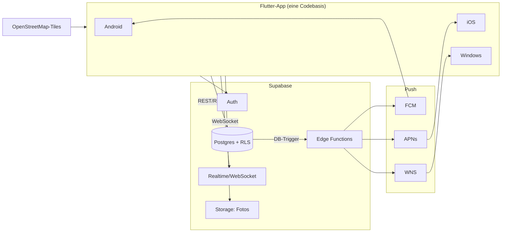

# 03 – Architektur & Tech-Stack

## Anforderung

Eine Codebasis für **Android, iOS und Windows** (macOS/Web als Bonus), mit
Echtzeit-Features (Beacons, Live-Karte), Push-Benachrichtigungen, Offline-Fähigkeit
und einem kleinen Team als Zielbetreiber.

## Framework-Entscheidung: Flutter

| Kriterium | **Flutter** ✅ | React Native | .NET MAUI | Kotlin Multiplatform |
|---|---|---|---|---|
| Android / iOS | ✅ erstklassig | ✅ erstklassig | ✅ gut | ✅ gut |
| **Windows** | ✅ stabil, ein Renderer | ⚠️ (Community-Fork) | ✅ gut | ⚠️ UI nicht geteilt |
| Ein UI-Code für alle | ✅ | ✅ (ohne Windows) | ✅ | ❌ |
| Karten, Kamera, Push – Ökosystem | ✅ sehr groß | ✅ groß | ⚠️ kleiner | ⚠️ kleiner |
| Konsistentes Design überall | ✅ eigener Renderer | ⚠️ native Widgets | ⚠️ | ⚠️ |

**Entscheidung: Flutter.** Ein Renderer auf allen Plattformen bedeutet: das
BrewMates-Design sieht überall identisch aus, und Windows ist ein First-Class-Target
statt eines Nachgedankens. macOS und Web fallen fast gratis ab.

- Sprache: **Dart**, State-Management: **Riverpod**, Navigation: **go_router**
- Lokale DB / Offline-Cache: **Drift** (SQLite)
- Karten: **flutter_map** (OpenStreetMap) – kein Google-Maps-Lock-in, läuft auch auf Windows; Tile-Hosting später über MapTiler/Protomaps skalierbar.

## Backend: Supabase (Backend-as-a-Service)

Für ein kleines Team ist ein BaaS der schnellste Weg zu Auth, Datenbank, Echtzeit und Storage:

| Baustein | Technologie | Zweck |
|---|---|---|
| Datenbank | **Supabase Postgres** | Alle Kern-Entitäten (siehe [Datenmodell](04-datenmodell.md)) |
| Auth | Supabase Auth | E-Mail, Google, Apple; JWT für alle API-Zugriffe |
| Echtzeit | **Supabase Realtime** | Live-Karte, Session-Teilnehmer, Feed-Updates (Postgres-Changes als WebSocket) |
| Storage | Supabase Storage | Check-in-Fotos, Avatare, Brauerei-Logos |
| Serverlogik | **Edge Functions** (Deno/TS) | Beacon-Fan-out, Abzeichen-Vergabe, Feed-Aggregation, Moderation |
| Zugriffskontrolle | **Row Level Security** | „Standort nur für bestätigte Freunde während aktiver Session" wird in der DB erzwungen, nicht nur im Client |

*Warum nicht Firebase?* Firestore macht relationale Abfragen (Feed = Check-ins der
Freunde, Join über 3 Tabellen) teuer und umständlich; Postgres + RLS passt zum stark
relationalen Datenmodell deutlich besser. Ein späterer Umzug auf selbst gehostetes
Postgres bleibt möglich (kein proprietäres Datenmodell).

## Push-Benachrichtigungen (3 Plattformen)

```
Edge Function „notify"
   ├─► FCM  ──► Android
   ├─► APNs ──► iOS  (inkl. Live Activity für aktive Sessions)
   └─► WNS  ──► Windows (Toast-Notifications)
```

Ein einheitlicher `notifications`-Datensatz in Postgres ist die Quelle der Wahrheit
(In-App-Glocke); die Edge Function fächert an die Plattformdienste auf. Geräte-Tokens
werden pro Gerät + Plattform in `devices` gespeichert.

## Gesamtbild



## Schlüssel-Flows

### Beacon-Fan-out (Session-Start)

1. Client legt `sessions`-Zeile an (Status `active`, Standort, Sichtbarkeit).
2. DB-Trigger ruft Edge Function `notify` auf.
3. Function ermittelt Zielgruppe (Freunde bzw. Crew, RLS-konform), schreibt `notifications` und pusht via FCM/APNs/WNS.
4. Freunde-Clients erhalten zusätzlich das Realtime-Event → Karte/Feed aktualisieren sich live.

### Offline-Check-in

1. Check-in wird lokal in Drift gespeichert (`pending`-Flag), UI zeigt ihn sofort.
2. Sync-Service schiebt bei Konnektivität alle `pending`-Zeilen nach Postgres (idempotent über Client-generierte UUIDs).
3. Konfliktregel: Check-ins sind append-only → keine echten Konflikte; Profil-Edits: last-write-wins.

### Standort-Privatsphäre (technisch erzwungen)

- `sessions.location` ist per RLS **nur** lesbar für: den Besitzer sowie bestätigte Freunde/Crew-Mitglieder, **und nur solange** `status = 'active'` und `expires_at > now()`.
- Auto-Ende: `pg_cron`-Job setzt abgelaufene Sessions auf `ended` – der Standort verschwindet serverseitig, selbst wenn ein Client nie „Beenden" drückt.

## Projektstruktur (Vorschlag)

```
brewmates/
├── app/                    # Flutter-App
│   ├── lib/
│   │   ├── core/           # Theme, Router, DI, Utils
│   │   ├── data/           # Repositories, Supabase-Client, Drift-DB
│   │   ├── domain/         # Modelle, Business-Logik
│   │   └── features/       # feed/, session/, checkin/, beers/, map/,
│   │                       # profile/, badges/, venues/, settings/
│   ├── windows/ android/ ios/ (Plattform-Shells)
│   └── test/
├── supabase/
│   ├── migrations/         # SQL-Schema (siehe Datenmodell)
│   └── functions/          # notify/, badges/, feed/
└── docs/                   # diese Dokumentation
```

## Qualität & Betrieb

- **CI/CD:** GitHub Actions – Lint + Tests je PR; Build-Matrix (APK / IPA / MSIX); Releases über Play Store, App Store/TestFlight, Microsoft Store (MSIX).
- **Tests:** Unit (Domain), Widget (Screens), ein Integrationspfad „Session starten → Freund erhält Benachrichtigung" gegen lokale Supabase-Instanz (`supabase start`).
- **Observability:** Sentry (Crashes, alle Plattformen), PostHog (Produkt-Events, opt-in).
- **Feature Flags:** einfache `remote_config`-Tabelle für schrittweises Ausrollen.
