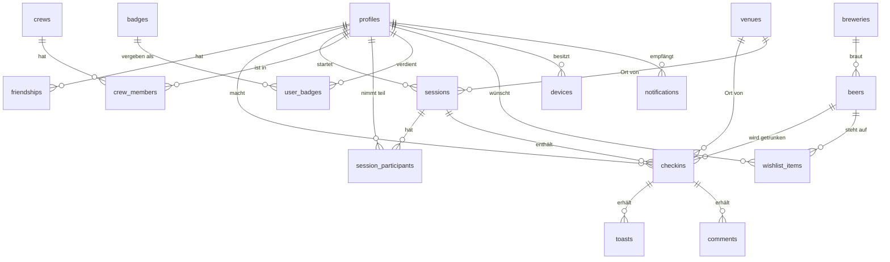

# 04 – Datenmodell

Postgres-Schema (Supabase). Alle IDs sind UUIDs (Client-generierbar für Offline-Sync),
alle Tabellen tragen `created_at`/`updated_at`. Row Level Security (RLS) ist auf jeder
Tabelle aktiv – die wichtigsten Policies stehen bei den Tabellen.

## ER-Diagramm

## Tabellen

### `profiles`
Erweitert `auth.users` (Supabase Auth).

| Spalte | Typ | Anmerkung |
|---|---|---|
| id | uuid PK | = auth.users.id |
| username | text unique | Handle, für Suche/QR |
| display_name | text | |
| avatar_url | text | Storage-Pfad |
| bio | text | |
| favorite_styles | text[] | |
| is_private | bool | Profil nur für Freunde |

### `friendships`
| Spalte | Typ | Anmerkung |
|---|---|---|
| id | uuid PK | |
| requester_id / addressee_id | uuid FK→profiles | `unique(requester, addressee)` |
| status | enum | `pending` · `accepted` · `blocked` |

RLS: sichtbar nur für die beiden Beteiligten. Hilfsfunktion `are_friends(a,b)`
(SECURITY DEFINER) wird von fast allen anderen Policies genutzt.

### `crews` / `crew_members`
Crews: `id, name, emoji, owner_id`. Members: `crew_id, profile_id, role(owner|member)`.
RLS: nur Mitglieder sehen Crew und Mitgliederliste.

### `sessions` *(das Beer-with-Me-Herzstück)*
| Spalte | Typ | Anmerkung |
|---|---|---|
| id | uuid PK | |
| host_id | uuid FK→profiles | |
| venue_id | uuid FK→venues, null | |
| message | text | „Tisch 12 im Garten" |
| location | geography(point), null | PostGIS; null bei Stealth |
| visibility | enum | `friends` · `crew` · `private` |
| crew_id | uuid, null | wenn visibility=crew |
| status | enum | `active` · `ended` |
| started_at / ended_at | timestamptz | |
| expires_at | timestamptz | Auto-Ende (Default +3 h) |

RLS (Kern der Privatsphäre): `SELECT` erlaubt für Host; für andere **nur wenn**
`status='active' AND expires_at > now()` **und** (bei `friends`: `are_friends()`,
bei `crew`: Mitglied). Ein `pg_cron`-Job beendet abgelaufene Sessions serverseitig.

### `session_participants`
`session_id, profile_id, kind(joined|toast)` – „Bin dabei!" vs. Fern-Prost.

### `breweries` · `beers`
Breweries: `id, name, country, city, logo_url, verified`.
Beers: `id, brewery_id, name, style, abv, ibu, description, label_url, is_alcohol_free, verified, created_by`.
Community-Einreichungen starten mit `verified=false` (Moderations-Queue).
Volltextsuche über `tsvector`-Index auf Name+Brauerei+Stil.

### `venues`
`id, name, location geography(point), address, osm_id, verified`. POI-Anlage aus
OpenStreetMap-Daten beim ersten Check-in an einem Ort.

### `checkins` *(das Untappd-Herzstück)*
| Spalte | Typ | Anmerkung |
|---|---|---|
| id | uuid PK | Client-generiert (Offline-Sync, idempotent) |
| profile_id | uuid FK | |
| beer_id | uuid FK | |
| session_id | uuid FK, null | Verknüpfung zum gemeinsamen Abend |
| venue_id | uuid FK, null | |
| rating | numeric(2,2), null | 0–5 in 0,25-Schritten |
| note | text | |
| photo_url | text | |
| flavor_tags | text[] | |
| serving_style | enum, null | draft · bottle · can · growler |
| visibility | enum | `friends` · `crew` · `private` |

RLS: Besitzer immer; sonst gemäß `visibility` (+`are_friends()`).

### `toasts` / `comments`
Toasts: `checkin_id, profile_id` (unique zusammen). Comments: `checkin_id, profile_id, body`.
Sichtbar für jeden, der den Check-in sehen darf.

### `badges` / `user_badges`
Badges: `id, slug, name, description, icon, rule jsonb` – Regel deklarativ
(z. B. `{"type":"distinct_styles","threshold":5}`), ausgewertet von der Edge Function
`badges` nach jedem Check-in/Session-Ende. User_badges: `profile_id, badge_id, level, awarded_at`.

### `wishlist_items`
`profile_id, beer_id, note` – unique zusammen.

### `devices`
`profile_id, platform(android|ios|windows), push_token, last_seen_at` – Ziele für FCM/APNs/WNS.

### `notifications`
`recipient_id, type, actor_id, subject_type/subject_id, read_at` – Quelle der Wahrheit
für die In-App-Glocke; Push ist nachgelagerter Fan-out.

## Abgeleitete Sichten

- **Feed:** View über `checkins` + `sessions` + `user_badges` der Freunde, sortiert nach Zeit; materialisiert erst bei Skalierungsbedarf.
- **Statistiken:** View pro Profil (distinct beers/styles/breweries/countries, Sessions gesamt, häufigster Mit-Trinker) – Basis für Profil & Jahresrückblick.
