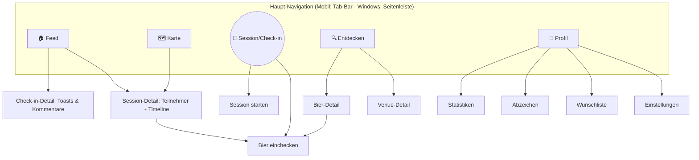

# 05 – UI & Screen-Flows

## Designprinzipien

1. **Der eine Tap.** Die wichtigste Aktion – Session starten – ist von überall in ≤ 2 Sekunden erreichbar (FAB in der Mitte der Tab-Bar).
2. **Zwei Tiefen.** Oberfläche einfach (Beacon, Prost, Foto); Tiefe optional (IBU, Geschmacks-Tags, Statistiken) – nie im Weg.
3. **Ein Design, drei Plattformen.** Gleiche Markensprache überall; Windows bekommt ein responsives Zwei-Spalten-Layout statt einer aufgeblasenen Telefon-UI.
4. **Dunkel & warm.** Bernstein/Kupfer-Palette auf dunklem Grund („Abend in der Bar"), heller Modus ebenfalls vollständig.

## Navigationsstruktur



## Kern-Screens

### 1. Feed (Start-Tab)
- **Aktive Sessions zuerst**: horizontale Karten-Leiste „Gerade unterwegs 🍻" mit Live-Sessions der Freunde → Tap = Session-Detail mit „Bin dabei!"/„Prost!".
- Darunter chronologischer Feed: Check-ins (Bier, Bewertung, Foto, Venue), beendete Sessions („Anna, Ben + 2 waren im Hopfengarten"), neue Abzeichen.
- Interaktion direkt in der Karte: 🍻 Toast, 💬 Kommentar.

### 2. Session starten (der „eine Tap")
```
┌──────────────────────────────┐
│  🍺 Bier-Zeit!               │
│  📍 Hopfengarten (erkannt)   │  ← Venue-Vorschlag per GPS, änderbar
│  💬 [Nachricht optional…]    │
│  Sichtbar für:               │
│  (●) Alle Freunde            │
│  ( ) Crew: Stammtisch  ▾     │
│  ( ) Nur ich (Stealth)       │
│  Auto-Ende: 3 h ▾            │
│                              │
│  [ 🍻 Los geht's! ]          │
└──────────────────────────────┘
```
Nach dem Start: Session-Banner bleibt app-weit oben sichtbar (Standort-Indikator!),
iOS zusätzlich als Live Activity auf dem Lock-Screen.

### 3. Check-in
- Suchfeld mit Sofortergebnissen (zuletzt getrunken zuerst), Barcode-Button [v1].
- Bewertungs-Slider (0–5 ⭐), Foto, Geschmacks-Tags als Chips, Venue/Session vorausgefüllt, Sichtbarkeit.
- „Speichern" funktioniert offline (Sync-Hinweis dezent).

### 4. Karte
- Nur Freunde mit aktiver Session (Avatar-Pin + Venue-Name); eigener Pin bei aktiver Session hervorgehoben.
- [v2] Umschalter „Venues entdecken" (Bars/Brauereien mit Tap-Listen).

### 5. Session-Detail („der Abend")
- Kopf: Host, Venue, Nachricht, Teilnehmer-Avatare, „Bin dabei!"-Button.
- Timeline: alle Check-ins der Teilnehmer in dieser Session, live aktualisiert.
- Nach Session-Ende wird derselbe Screen zum geteilten Erinnerungs-Album.

### 6. Bier-Detail
- Stil, ABV, IBU, Brauerei, Beschreibung, Ø-Bewertung (global & im Freundeskreis).
- Buttons: Einchecken · Auf Wunschliste; Liste „Freunde, die es getrunken haben".

### 7. Profil & Statistiken
- Kacheln: einzigartige Biere · Stile · Brauereien · Länder · gemeinsame Abende.
- Abzeichen-Galerie; Tagebuch (durchsuchbare Check-in-Historie); Wunschliste.

## Windows-Layout

```
┌────────┬───────────────────────┬──────────────────────┐
│ Seiten-│  Liste (Feed/Karte/   │  Detail (Check-in,   │
│ leiste │  Entdecken/Tagebuch)  │  Session, Bier …)    │
│ 🏠🗺️🍺🔍👤 │                     │                      │
└────────┴───────────────────────┴──────────────────────┘
```
- Master-Detail statt Navigation-Stack; Statistiken & Tagebuch nutzen die volle Breite (Diagramme, Tabellenansicht mit Sortierung/Filter).
- Tastatur: `Strg+N` Check-in, `Strg+S` Session, `↑/↓` Listen-Navigation.

## Onboarding-Flow

1. Registrieren (E-Mail/Google/Apple) → Altersbestätigung.
2. Profil: Name + Avatar (überspringbar).
3. **Freunde finden** (QR zeigen/scannen, Nutzername suchen) – der entscheidende Schritt, prominent erklärt: „BrewMates ohne Freunde ist ein Bier allein."
4. Benachrichtigungen erlauben (mit Begründung: „Damit du erfährst, wenn deine Freunde anstoßen").
5. Optional: erstes Bier einchecken (geführt, 3 Schritte).

## Leere Zustände & Töne

- Feed leer: „Noch ruhig hier. Starte eine Session oder lade Freunde ein 🍻" + beide Buttons.
- Sprachton: warm, kumpelhaft, nie albern; durchgehend Du-Form (DE) / casual (EN). Lokalisierung DE + EN ab MVP.
