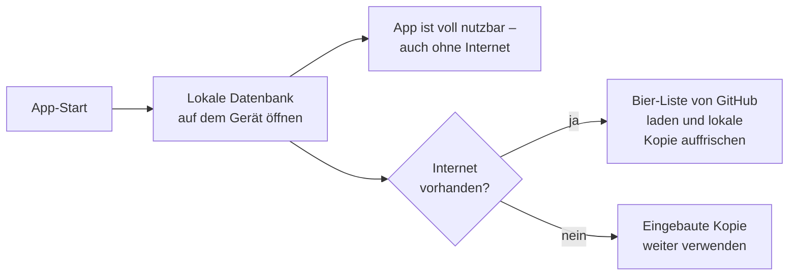
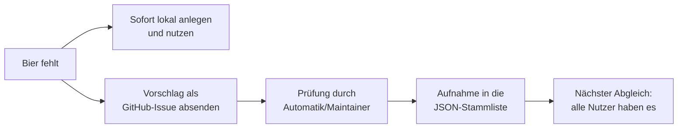

# 08 – So funktioniert BrewMates (für alle verständlich)

Dieses Dokument erklärt ohne Fachchinesisch, was die App macht, wo Ihre Daten
liegen und wie das Projekt weiterentwickelt wird. Es richtet sich bewusst an
Menschen, die **nicht** programmieren.

## Was die App kann – in drei Sätzen

BrewMates dreht sich um zwei große Knöpfe auf dem Startbildschirm:
**„🍺 Bier scannen"** (Barcode der Flasche scannen → Bier erkannt → bewerten
→ ins Tagebuch; dazu Abzeichen, Wunschliste, Statistiken) und
**„🍻 Zusammenkommen!"** (ein Tap: Ihre Session startet mit echtem
GPS-Standort, (in Version 1: Demo-)Freunde sehen Sie auf der Karte –
Botschaft: „Alle willkommen!"). Die App läuft auf Android (die iOS-Variante
bleibt technisch offen) und funktioniert komplett ohne Konto und ohne
Anmeldung.

### Was passiert beim Scannen?

1. Kamera an, Strichcode in den Rahmen – die Erkennung läuft komplett auf
   Ihrem Gerät, es werden keine Fotos gespeichert oder verschickt.
2. Die App sucht den Code zuerst in ihrer lokalen Bier-Datenbank.
3. Nur wenn er dort unbekannt ist, fragt sie die freie Produktdatenbank
   **Open Food Facts** – übertragen wird dabei nur die Ziffernfolge des
   Barcodes.
4. Gefunden → Formular ist vorausgefüllt; nirgends bekannt → Sie legen das
   Bier in 30 Sekunden selbst an (und können es der Community vorschlagen).
   Kein Kamera-Zugriff gewünscht? Der Code lässt sich immer auch eintippen.

### Was passiert beim „Zusammenkommen!"?

Ein Tap: Die App fragt (einmalig) nach der Standort-Berechtigung, startet
Ihre Session mit der Nachricht „Alle willkommen! 🍻" und zeigt Sie auf der
Karte. Nach 3 Stunden endet die Session automatisch. In Version 1.x bleibt
der Standort dabei **rein lokal auf dem Gerät** – erst mit der Online-Stufe
(echte Freunde) wird er – nur für Freunde, nur während der Session – geteilt.
Ohne Standort-Freigabe wählen Sie den Ort einfach von Hand.

## Wo welche Daten liegen – das Herzstück

Die wichtigste Eigenschaft von BrewMates: **Ihre Daten gehören Ihnen und
bleiben auf Ihrem Gerät.** Die folgende Tabelle zeigt für jeden Datentyp, wo
er gespeichert ist und ob dafür eine Internetverbindung nötig ist.

| Was | Wo gespeichert | Geht online? |
|---|---|---|
| **Ihre Nutzerdaten**: Profil, Check-ins, Bewertungen, Sessions, Abzeichen, Wunschliste, Tagebuch, Statistiken | Nur in einer lokalen Datenbank (SQLite) auf Ihrem Gerät | **Nein.** Verlässt das Gerät nie. Kein Konto, keine Server des Anbieters, keine Analyse- oder Werbe-Software |
| **Die Karte** | Wird nicht gespeichert, sondern bei Bedarf Stück für Stück angezeigt | **Ja**, nur beim Öffnen der Karte: Kartenkacheln kommen von OpenStreetMap (tile.openstreetmap.org). Dabei wird technisch bedingt Ihre IP-Adresse übertragen – so wie bei jedem Webseiten-Aufruf |
| **Die Bier- und Brauerei-Datenbank** (Biere und Brauereien aus Österreich und Bayern) | Als Kopie fest in der App eingebaut **und** als gemeinsame „Stammliste" im GitHub-Repository (Ordner `app/assets/data/`) | **Ja, aber nur lesend**: Beim App-Start und auf Knopfdruck holt sich die App die aktuelle Liste von GitHub und frischt die lokale Kopie auf. Ohne Internet nutzt sie einfach die eingebaute Kopie |
| **Etikett-Fotos** der Biere | Nur als Link in der Datenbank hinterlegt (Fotos: Open Food Facts, Lizenz CC-BY-SA) | **Ja, beim Anzeigen**: Das Foto wird von images.openfoodfacts.org geladen – wie ein Bild auf einer Webseite. Ohne Internet erscheint stattdessen das 🍺-Symbol |
| **Die „Freunde"** ohne Konto (abgemeldet) | Demo-Daten auf Ihrem Gerät | **Nein.** Es sind Beispielpersonen, keine echten Menschen |
| **Gescannte Barcodes** | Werden dem jeweiligen Bier in der lokalen Datenbank zugeordnet | **Nur bei unbekannten Codes**: Anfrage (nur die Ziffernfolge) an Open Food Facts (world.openfoodfacts.org) |
| **Ihr GPS-Standort** (Beacon/Session) | Nur in der lokalen Datenbank, nur während einer aktiven Session, keine Historie | **Nein** (in Version 1.x verlässt der Standort das Gerät nicht) |
| **Online-Modus (optional)**: eigene Check-ins & aktive Sessions | Supabase-Server (EU), nur für bestätigte Freunde sichtbar | **Ja**, nur solange Sie angemeldet sind |

### „Offline-first" – die Notizbuch-Metapher

Stellen Sie sich BrewMates wie ein **privates Notizbuch** vor, das Sie immer
dabeihaben. Alles, was Sie hineinschreiben – jedes Bier, jede Bewertung, jeder
Abend – steht nur in diesem Notizbuch. Niemand sonst kann hineinschauen.

Zusätzlich hängt im Ort ein **schwarzes Brett** (das GitHub-Repository), auf
dem eine gemeinsam gepflegte Liste aller österreichischen Biere und Brauereien
aushängt. Wenn Sie daran vorbeikommen (sprich: Internet haben), wirft die App
kurz einen Blick darauf und schreibt Neuigkeiten in Ihr Notizbuch ab. Kommen
Sie nicht vorbei, ist das kein Problem – eine Abschrift der Liste klebt
ohnehin hinten im Notizbuch. Wichtig: Die App **liest nur** vom schwarzen
Brett. Sie hängt dort nie etwas über Sie auf.

## Was genau beim App-Start passiert

1. **Die App öffnet Ihr Notizbuch**: Sie liest die lokale Datenbank auf dem
   Gerät. Beim allerersten Start wird diese Datenbank angelegt und mit der
   eingebauten Bier-Liste sowie den drei Demo-Freunden gefüllt.
2. **Alles ist sofort da**: Feed, Tagebuch, Statistiken und Abzeichen kommen
   vollständig aus dieser lokalen Datenbank – dafür ist kein Internet nötig.
3. **Kurzer Blick aufs schwarze Brett**: Im Hintergrund versucht die App, die
   aktuellen Bier- und Brauerei-Dateien (JSON-Dateien) von GitHub
   (raw.githubusercontent.com) zu laden. Klappt das, aktualisiert sie die
   lokale Bier-/Brauerei-Liste – neue Biere aus der Community erscheinen dann
   automatisch. Klappt es nicht (kein Netz, GitHub nicht erreichbar), passiert
   einfach nichts weiter; die App läuft mit dem letzten Stand normal weiter.
   Denselben Abgleich können Sie jederzeit auch von Hand per Knopfdruck
   anstoßen.
4. **Karte nur auf Wunsch**: Erst wenn Sie die Kartenansicht öffnen, lädt die
   App Kartenbilder von OpenStreetMap. Öffnen Sie die Karte nicht, findet
   dieser Abruf nicht statt.

## Wie ein neues Bier in die gemeinsame Datenbank kommt

Sie entdecken ein Bier, das in BrewMates noch fehlt? So läuft es ab:

1. **Sofort für Sie selbst**: Sie legen das Bier direkt in der App an. Es
   landet in Ihrer lokalen Datenbank und Sie können es ab sofort einchecken
   und bewerten – ganz ohne Internet und ohne auf irgendjemanden zu warten.
2. **Vorschlag für alle**: Zusätzlich können Sie das Bier der Community
   vorschlagen. Die App öffnet dafür ein vorausgefülltes Formular auf GitHub
   (ein sogenanntes „Issue" – siehe Begriffserklärung unten). Name, Brauerei,
   Stil usw. sind schon eingetragen; Sie müssen nur noch absenden. Dafür
   braucht man ein (kostenloses) GitHub-Konto.
3. **Prüfung**: Ein Automatismus bzw. ein Betreuer des Projekts („Maintainer")
   schaut sich den Vorschlag an – stimmt der Name, gibt es das Bier wirklich,
   ist es ein Duplikat?
4. **Aufnahme in die Stammliste**: Passt alles, wird das Bier in die
   JSON-Dateien im Repository übernommen – also ans schwarze Brett gehängt.
5. **Ankunft bei allen**: Beim nächsten Abgleich (App-Start oder Knopfdruck)
   laden alle Nutzerinnen und Nutzer die aktualisierte Liste – und Ihr
   vorgeschlagenes Bier ist plötzlich überall auswählbar.

Zwei Dinge bleiben dabei immer privat bzw. getrennt:

- **Ihre persönlichen Bewertungen** verlassen das Gerät nicht – eingereicht
  werden nur die Fakten zum Bier (Name, Brauerei, Stil …).
- Das Feld **community_rating** in der Datenbank ist keine Sammlung von
  Nutzerbewertungen, sondern eine **redaktionelle Einschätzung** der
  Datenbank-Pflegenden – vergleichbar mit einer Empfehlung im Bierführer.

## Wie die App weiterentwickelt wird

BrewMates wird offen auf GitHub entwickelt. Ein paar Grundbegriffe, damit Sie
mitreden können:

- **Repository (kurz „Repo")**: Der Projektordner im Internet – er enthält den
  gesamten Quellcode, die Dokumentation und die gemeinsame Bier-Datenbank.
  Vergleichbar mit einem öffentlichen Aktenschrank, in dem jede Änderung
  nachvollziehbar abgelegt wird.
- **Issue**: Ein Eintrag im „Kummerkasten" des Projekts – eine Fehlermeldung,
  ein Wunsch oder eben ein Bier-Vorschlag. Jeder mit GitHub-Konto kann Issues
  anlegen und mitdiskutieren.
- **Pull Request**: Ein konkreter Änderungsvorschlag am Projekt („Ich habe das
  hier verbessert – bitte übernehmen"). Er wird geprüft und dann angenommen
  oder abgelehnt.
- **Release**: Eine fertig geschnürte, nummerierte Version der App (z. B.
  v1.0) samt Installationsdatei – wie eine neue Auflage eines Buches.

**Fehler melden oder Wünsche äußern**: Auf der GitHub-Seite des Projekts den
Reiter „Issues" öffnen, „New issue" wählen und beschreiben, was passiert ist
oder was Sie sich wünschen. Je konkreter (Was haben Sie getan? Was ist
passiert? Was hätten Sie erwartet?), desto besser.

**Die neueste App-Version (APK) bekommen**: Auf der GitHub-Seite des Projekts
den Bereich **„Releases"** öffnen (direkt erreichbar unter
`github.com/ORPA1988/BrewMates/releases/latest`). Dort die `.apk`-Datei
herunterladen und auf dem Android-Gerät öffnen – Android führt dann durch die
Installation. Hinter den Kulissen läuft das automatisch: Sobald die Entwickler
eine Version mit einem Etikett wie `v1.0` markieren, baut ein
CI-Automatismus (eine Art Fließband) die APK und veröffentlicht sie auf der
Releases-Seite.

## Der Online-Modus (Beta): echte Freunde

Seit der Online-Beta (v0.9) kann BrewMates auf Wunsch mehr als ein privates
Notizbuch sein. So funktioniert es:

1. **Einmal registrieren**: In der App ein Konto anlegen – mit E-Mail-Adresse,
   Passwort und einem frei gewählten Nutzernamen. Das ist komplett freiwillig;
   ohne Konto ändert sich an der App **gar nichts**.
2. **Freunde finden**: Sie suchen Ihre Freunde über deren Nutzernamen und
   schicken eine Freundschaftsanfrage. Erst wenn die Gegenseite bestätigt,
   sind Sie verbunden – niemand kann Sie ungefragt „abonnieren".
3. **Gegenseitig sehen**: Ab dann erscheinen die Beacons Ihrer Freunde live
   auf Ihrer Karte (und Ihrer auf deren Karte), und Ihre Check-ins tauchen im
   Feed der Freunde auf – binnen Sekunden, nicht erst beim nächsten App-Start.

Sobald Sie angemeldet sind, verschwinden die Demo-Freunde und echte Freunde
übernehmen. Melden Sie sich ab, läuft die App wieder rein lokal wie zuvor.

**Was wird dabei übertragen?** Nur zwei Dinge, und beide sind ausschließlich
für Ihre bestätigten Freunde sichtbar (das erzwingt der Server selbst, nicht
nur die App): Ihre eigenen **Check-ins** (Biername, Brauerei, Stil, Bewertung,
Notiz, Ortsname) und Ihre **aktiven Sessions** (Ortsname, Nachricht,
Koordinaten, Ablaufzeit). Sessions sind nur sichtbar, solange sie laufen –
nach dem automatischen Ende verschwindet der Standort. Gespeichert wird das
beim Dienstleister Supabase auf Servern in der EU. Alle Details stehen in der
[Datenschutzerklärung](../PRIVACY.md), Abschnitt 4d.

## Grenzen der Beta – ehrlich gesagt

- **Abgemeldet sind die Freunde weiterhin Demo-Daten.** Ohne Konto sind die
  drei Freunde samt ihrer Aktivität Beispielfiguren auf Ihrem Gerät, damit
  die App von Anfang an lebendig wirkt. **Angemeldet** gilt das nicht mehr:
  Dann sind Freunde, Live-Karte und Feed echt.
- **Noch nicht fertig in der Beta:** „Prost!" und Kommentare auf
  Online-Check-ins von Freunden, die Konto-Löschung direkt in der App (in
  der Beta auf Anfrage möglich) und Push-Benachrichtigungen bei
  geschlossener App – Beacons erscheinen live, solange die App offen ist.
- **Der GitHub-Abgleich ist eine Einbahnstraße.** Die App liest die
  gemeinsame Bier-Liste nur; sie lädt nie etwas über Sie hoch.
  Bier-Vorschläge laufen bewusst über das separate Issue-Formular, das Sie
  selbst aktiv absenden.
- **Kein voller Gerätewechsel-Komfort.** Mit Konto werden neue Check-ins für
  Freunde gespiegelt – der bestehende lokale Alt-Bestand (Tagebuch,
  Abzeichen, Wunschliste) wandert aber noch nicht automatisch ins Konto.
  Ein Upload-Assistent dafür steht auf der Roadmap.
