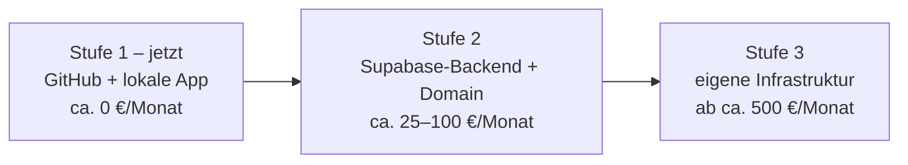

# 09 – Wenn BrewMates groß wird: Skalierung & Geschäftsmodell

Dieses Dokument beschreibt nüchtern, wie BrewMates wachsen kann: warum die
heutige „GitHub-als-Server"-Lösung für den Anfang genau richtig ist, welche
Ausbaustufen es gibt, was das ungefähr kostet und womit sich die App eines
Tages finanzieren könnte. Alle Zahlen sind **Schätzungen und Größenordnungen**,
keine Angebote.

## Warum GitHub als „Server" nur für den Anfang taugt

Heute nutzt BrewMates GitHub für zwei Dinge – und dafür ist GitHub sogar
hervorragend geeignet:

1. **Als versionierten, kostenlosen Speicher für die redaktionelle
   Bier-Datenbank.** Die JSON-Dateien werden nur gelesen, ändern sich selten,
   jede Änderung ist nachvollziehbar (wer hat wann welches Bier ergänzt?), und
   das Ausliefern solcher statischen Dateien ist billig und gut zwischenzuspeichern.
   Das ist wie ein schwarzes Brett: eine Person hängt etwas auf, tausende
   lesen es – kein Problem.
2. **Als Verteilkanal für die App selbst** (Releases-Seite mit APK) samt
   Fehlermeldungen und Bier-Vorschlägen über Issues.

Was GitHub dagegen **nicht** kann – und auch nie können soll:

- **Keine Nutzerkonten**: GitHub kennt nur GitHub-Konten von Entwicklern,
  keine App-Logins mit Passwort-Zurücksetzen, Profilbild und Freundesliste.
- **Keine Live-Daten**: „Anna hat gerade eine Session gestartet" muss in
  Sekunden bei ihren Freunden ankommen. GitHub-Dateien sind dafür viel zu
  träge – das schwarze Brett eignet sich nicht als Walkie-Talkie.
- **Keine privaten Daten**: Das Repository ist öffentlich. Persönliche
  Check-ins oder Standorte dort abzulegen wäre, als würde man sein Tagebuch
  ans schwarze Brett heften.
- **Keine Schreiblast**: Wenn tausende Apps gleichzeitig schreiben wollten,
  greifen GitHubs Abruf-Begrenzungen (Rate-Limits). Es gibt keine
  App-taugliche Anmeldung (Auth), keine Abfragesprache („zeig mir alle IPAs
  im Umkreis von 5 km") und keinen Schutz vor Missbrauch (Spam, Vandalismus,
  gefälschte Einträge).

### Ampel-Tabelle: Was auf GitHub bleiben kann – und was nicht

| | Daten/Aufgabe | Bewertung |
|---|---|---|
| 🟢 | Redaktionelle Bier-/Brauerei-Datenbank (JSON, nur lesend) | Bleibt gerne auf GitHub – ideal |
| 🟢 | App-Verteilung über Releases (APK) | Bleibt gerne auf GitHub – ideal |
| 🟢 | Fehlermeldungen, Wünsche, Bier-Vorschläge (Issues) | Bleibt gerne auf GitHub – ideal |
| 🟡 | Auslieferung der Bier-Datenbank an sehr viele Nutzer | Geht anfangs, ab großen Nutzerzahlen besser über ein CDN (siehe Stufe 3) |
| 🔴 | Nutzerkonten & Anmeldung | Ungeeignet – braucht ein Backend |
| 🔴 | Echte Freunde, Live-Sessions, Live-Karte, Push | Ungeeignet – braucht ein Backend |
| 🔴 | Private Nutzerdaten (Check-ins, Standorte, Fotos) | Ungeeignet – niemals in ein öffentliches Repository |
| 🔴 | Viele gleichzeitige Schreibzugriffe aus der App | Ungeeignet – Rate-Limits, keine Auth, kein Missbrauchsschutz |

## Ausbaustufen und ungefähre Monatskosten

### Stufe 1 – Jetzt: GitHub + lokale App *(ca. 0 €/Monat)*

Genau der heutige Stand: Alle Nutzerdaten lokal auf dem Gerät, die
redaktionelle Bier-Datenbank und die App-Verteilung auf GitHub, Karte von
OpenStreetMap. Laufende Kosten: praktisch null. Diese Stufe trägt erstaunlich
weit – solange die App vor allem ein persönliches Bier-Tagebuch ist.

### Stufe 2 – Echtes Backend *(ca. 25–100 €/Monat)*

Sobald echte Freunde, Live-Sessions und Push-Benachrichtigungen kommen sollen,
braucht es einen Server im Hintergrund. Die Vorarbeit liegt schon im
Repository: Der Ordner `supabase/` enthält das vorbereitete Datenbank-Schema
für **Supabase**, einen Backend-Dienst, der Konten, Datenbank, Echtzeit-Updates
und Zugriffsregeln aus einer Hand liefert.

- **Supabase**: Einstieg ab ca. 25 €/Monat (Pro-Tarif), mit wachsender Nutzung
  eher ca. 50–100 €/Monat.
- **Eigene Domain** – Vorschlag: **brewmates.at** (ca. 15–30 €/Jahr): dient
  als Adresse für eine kleine Website, eine stabile URL für die
  Datenschutzerklärung, den API-Endpunkt und eine Support-Mail-Adresse
  (z. B. support@brewmates.at). Wirkt seriös und macht die App unabhängig von
  fremden Adressen.
- **Push-Versand** (über Firebase Cloud Messaging): in üblichen
  Größenordnungen kostenlos.

### Stufe 3 – Ab ca. zehntausenden Nutzern *(ab ca. 500 €/Monat, je nach Wachstum)*

Ab dieser Größe stoßen die „geliehenen" Gratis-Dienste an Grenzen:

- **Eigener Kartenkachel-Server oder Bezahl-Kartendienst** (ca. 50–200 €/Monat):
  Die OpenStreetMap Foundation stellt ihre Kachel-Server unter
  Fair-Use-Bedingungen bereit – gedacht für kleine Projekte, nicht für Apps
  mit Massenverkehr. Wer groß wird, muss die Karte selbst hosten oder einen
  kommerziellen Anbieter (z. B. auf OSM-Basis) bezahlen. Alles andere wäre
  unfair gegenüber dem Gemeinschaftsprojekt OSM.
- **CDN für die Bier-Datenbank** (ca. 5–20 €/Monat): Ein Verteilnetz, das die
  JSON-Dateien weltweit zwischenspeichert, statt jeden Abruf auf GitHub zu
  lenken.
- **Dedizierte Postgres-Datenbank** statt geteilter Instanz
  (ca. 100–400 €/Monat): mehr Leistung, planbare Antwortzeiten.
- **Monitoring & Fehler-Auswertung** (ca. 0–50 €/Monat): Damit man Ausfälle
  bemerkt, bevor es die Nutzer tun.

## Geschäftsmodell – realistisch betrachtet

Wichtig vorweg: Eine Bier-App ist ein Nischenprodukt. Selbst Untappd mit
Millionen Nutzern lebt von einem Mix aus Abo und Partnerschaften. Für
BrewMates kommen vier Bausteine infrage:

### 1. Werbung (AdMob)

Dezent platzierte Banner, z. B. nur im Entdecken-Bereich – nie im Tagebuch,
nie im Check-in-Fluss. **Aber Vorsicht**: Für Alkohol-Themen gelten strenge
Werberichtlinien (AdMob und Play Store schränken Alkohol-Werbung stark ein),
und die App richtet sich ausschließlich an Erwachsene (18+) – das muss auch
die Werbeausspielung respektieren. Der Ertrag ist überschaubar: Als grobe
Größenordnung bringen Banner ca. 0,50–3 € pro tausend Einblendungen (eCPM) –
bei kleinen Nutzerzahlen also eher Taschengeld als Finanzierung.

### 2. Premium: „BrewMates Pro" *(empfohlener Kern)*

Ein freiwilliges Abo für ca. 2–4 €/Monat mit Komfort-Funktionen:

- erweiterte Statistiken und Auswertungen,
- Jahresrückblick („Ihr Bierjahr 2027"),
- Datenexport,
- Cloud-Speicher für eigene Etikettenfotos,
- werbefrei.

Wichtig: Die Kernfunktionen (Tagebuch, Check-ins, Sessions) bleiben gratis –
Pro verkauft Komfort, nicht die App.

### 3. Brauerei- und Venue-Partnerschaften

Verifizierte Profile für Brauereien und Lokale, gepflegte Tap-Listen
(„Was läuft gerade vom Fass?"), Event-Ankündigungen – gegen eine monatliche
Gebühr. **Rote Linie**: Die Unabhängigkeit der Bewertungen. Partner dürfen
sichtbarer sein, aber niemals besser bewertet werden oder Bewertungen
beeinflussen. Sobald Nutzer den Eindruck haben, Bewertungen seien käuflich,
ist das Vertrauen – und damit die App – erledigt.

### 4. Affiliate (Bier-Shops)

Verweise auf Online-Bier-Shops („Dieses Bier bestellen bei …") mit kleiner
Provision pro Verkauf. Unaufdringlich machbar, Ertrag klein, klar als
Werbung/Partnerlink gekennzeichnet.

### Empfohlene Reihenfolge

1. **Erst Nutzer, dann Geld**: In Stufe 1 gar nicht monetarisieren.
2. **Pro-Abo zuerst** (mit Stufe 2): fair, planbar, passt zur
   Privatsphäre-Haltung der App.
3. **Partnerschaften danach**, sobald es lokal genug Nutzer gibt, dass ein
   verifiziertes Profil für eine Brauerei etwas wert ist.
4. **Werbung und Affiliate zuletzt** und nur dezent – als Zubrot, nicht als
   Fundament.

### Was BrewMates NICHT tun sollte

- **Bewertungen verkaufen** oder Rankings gegen Geld beeinflussen.
- **Nutzerdaten verkaufen** oder für Werbe-Tracking auswerten – das würde das
  zentrale Versprechen der App brechen.
- **Konsum-Anreize setzen**: keine Abzeichen für Menge, keine „Trink noch
  eins!"-Mechaniken, keine Rabattaktionen, die zu Mehrkonsum verleiten. Die
  App belohnt Vielfalt, Orte und Gemeinsamkeit – dabei bleibt es.

## Datenschutz-Konsequenz je Stufe

| Stufe | Was sich beim Datenschutz ändert |
|---|---|
| **Stufe 1 (jetzt)** | Die bestehende Datenschutzerklärung passt: Daten nur lokal; nach außen gehen nur der Kachelabruf bei OpenStreetMap und der rein lesende Abruf der Bier-Datenbank von GitHub (jeweils technisch bedingt inkl. IP-Adresse). |
| **Stufe 2 (Backend)** | Großer Einschnitt: Sobald Konten, Freunde und Sessions auf einem Server liegen, verarbeitet der Anbieter erstmals personenbezogene Daten. Nötig sind u. a.: eine **neue Datenschutzerklärung**, ein **Auftragsverarbeitungsvertrag (AVV)** mit Supabase, eine bewusste Wahl der **Server-Region (EU)**, Funktionen für **Konto-Löschung und Datenexport** (DSGVO-Rechte), klare Regeln für Standortdaten (nur während aktiver Sessions, automatisches Ende, keine Historie) und ein Prozess für Auskunftsanfragen. Bei Push kommt Google/Firebase als weiterer Dienstleister hinzu. |
| **Stufe 3 (eigene Infrastruktur)** | Zusätzlich: AVVs mit CDN-, Hosting- und Monitoring-Anbietern; bei Werbung (AdMob) Einwilligungsabfrage (Consent) und erneute Überarbeitung der Datenschutzerklärung; ggf. Datenschutz-Folgenabschätzung wegen Standortdaten in großem Maßstab. |

## Fazit mit Entscheidungspunkten

- **Bis ca. 1.000–5.000 Nutzer reicht Stufe 1 völlig** – solange die App als
  lokales Bier-Tagebuch mit gemeinsamer Bier-Datenbank verstanden wird.
  Kosten: praktisch null.
- **Stufe 2 startet nicht bei einer Nutzerzahl, sondern bei einem Feature**:
  dem echten Mehrspieler-Betrieb. Sobald echte Freunde und Live-Sessions
  kommen sollen, führt am Backend (Supabase) und an einer neuen
  Datenschutzerklärung kein Weg vorbei. Spätestens dann lohnen sich auch
  Domain (brewmates.at) und Support-Mail.
- **Stufe 3 wird ab ca. mehreren zehntausend aktiven Nutzern relevant** –
  erkennbar daran, dass Kartenabrufe die OSM-Fair-Use-Grenzen berühren, die
  Datenbank spürbar langsamer wird oder GitHub-Abrufe an Limits stoßen.
- **Monetarisierung frühestens mit Stufe 2** und dann zuerst über ein faires
  Pro-Abo. Werbung und Partnerschaften nur so, dass das wichtigste Kapital
  der App unangetastet bleibt: das Vertrauen, dass Daten privat bleiben und
  Bewertungen ehrlich sind.
